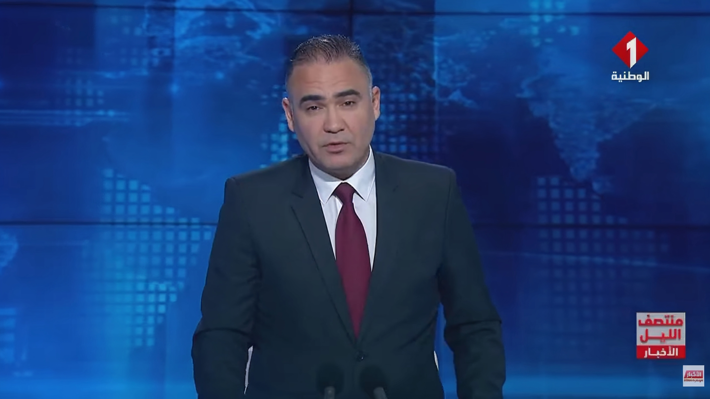

# AI News Presenter

AI pipeline to recreate a television news broadcast using artificial intelligence.

The project replaces the original presenter with an AI-generated presenter using:

- Voice cloning
- AI presenter animation
- Lip synchronization
- Video editing

---

# resources :
1-photo :

  

2_origine news :

https:www.youtube.com/watch?v=e43UKFaqnwA

3- clone news :

https://youtube.com/watch?v=4kXmf8omRt8&list=PLgLph9Uvh6mIYlPY5qaGASoFVXr7IKHk2

---

# Project Pipeline

Original News Broadcast 

↓  
Extract Script  
↓  
Extract Presenter Voice  
↓  
Clean Audio  
↓  
Clone Voice (ElevenLabs)  
↓  
Generate Narration  
↓  
Prepare Presenter Image  
↓  
Animate Presenter (HeyGen)  
↓  
Lip Sync  
↓  
Import into Lightworks  
↓  
Replace Original Presenter  
↓  
Insert News Elements  
↓  
Export Final Broadcast

---

# Tools Used

| Tool | Purpose |
|-----|------|
| YouTube Downloader | Download news broadcast |
| UVR | Extract presenter voice |
| Audacity | Clean audio |
| ElevenLabs | Voice cloning |
| Leonardo AI | Image enhancement |
| HeyGen | Presenter animation |
| Lightworks | Video editing |

More details in:

- pipeline.md

- tools.md

